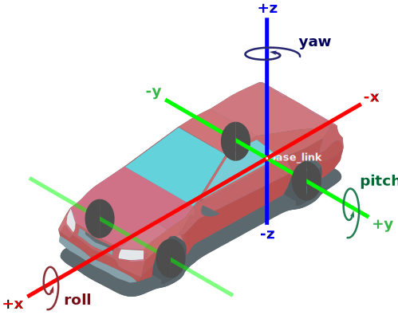
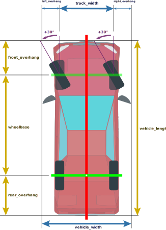

# Vehicle dimensions

## Vehicle axes and base_link

{: style="width:500px"}

`base_link` frame is in the center of the rear axle.
`base_link` used very frequently throughout the stack.

- Localization module outputs the `map` to `base_link` transformation.
- Planning module plans the poses for where the `base_link` frame should be in the future.
- Control module tries to fit `base_link` to incoming poses.

## Vehicle dimensions

{: style="width:750px"}

### wheelbase

The distance between front and rear axles.

### track_width

The distance between left and right wheels.

### Overhangs

Overhangs are part of the minimum safety box calculation.

While measuring overhangs, take side mirrors, protruding sensors, wheels to the consideration.

#### left_overhang

The distance between axis centers of left wheels and the left-most point of the vehicle.

#### right_overhang

The distance between axis centers of right wheels and the right-most point of the vehicle.

#### front_overhang

The distance between front axle and the foremost point of the vehicle.

#### rear_overhang

The distance between rear axle and the rear-most point of the vehicle.

### length

Total length of the vehicle.

Also calculated by `front_overhang + wheelbase + rear_overhang`

### width

Total width of the vehicle.

Also calculated by `left_overhang + track_width + right_overhang`

## Wheel orientations

If the vehicle is going forward, a positive wheel angle will result in vehicle turning left.

Autoware assumes the rear wheels don't turn on `z` axis.

## Notice

Vehicle used in the illustrations created by xvlblo22 and is from <https://www.turbosquid.com/3d-models/modular-sedan-3d-model-1590886>
